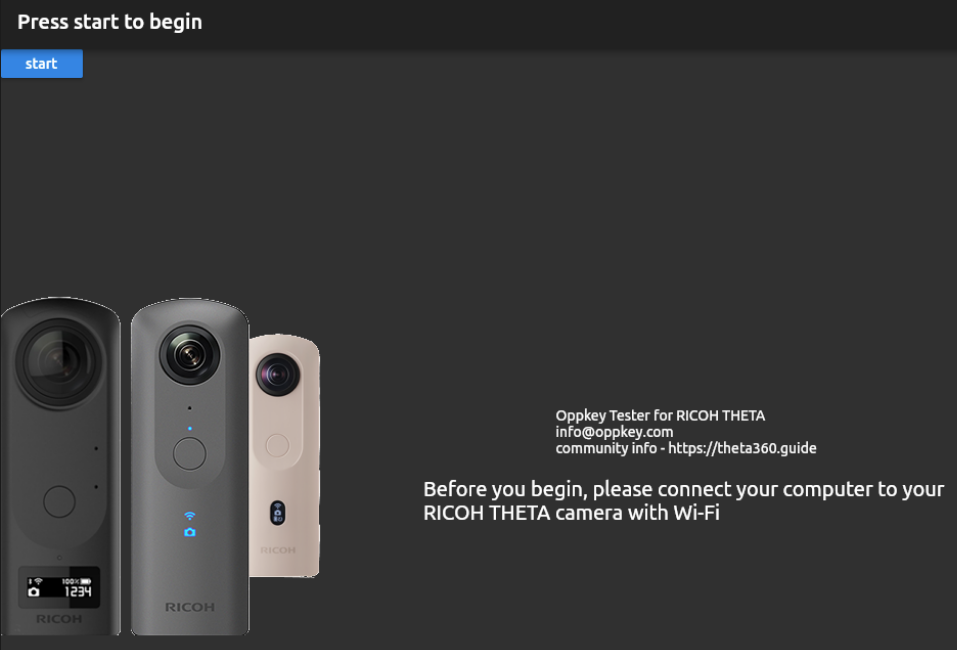
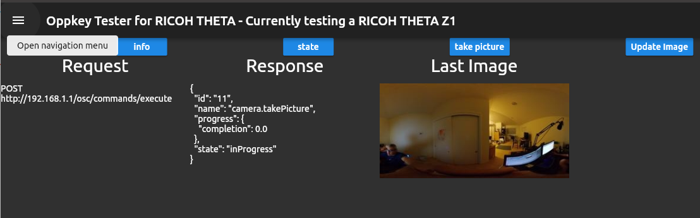

# Oppkey Tester for RICOH THETA Cameras

This application is available for mobile and desktop. It is a tester for RICOH THETA 360 camera Wi-Fi APIs. It demos fundamental API commands that provide key information for creating successful applications for the RICOH THETA.

[Project Documentation](https://codetricity.github.io/oppkey_tester_ricoh_theta/doc/api/index.html)

## Introduction

An application of RICOH THETA camera functionality utilizing Wi-Fi APIs.

The application is written in Dart. Key API commands can be extrapolated if your development language is different. Usage and key functionality should be clear even if you are implementing in a different programming language.

Commands covered include info and state which provide information on the camera and the ability take a picture. 

Key development commands include the enable/disable sleep commands. Having the camera going to sleep which doing development can be avoided. Similarly, enable/disable power off is demostrated as well.

Commands to take a picture, and then display the thumbnail. Most applications will require this functionality. The application shows how to display the thumbnails and how to implement pinch to zoom. 

More powerful commands like delete all, which is useful in a development environment to elimate test pictures, and reset settings are also shown fully implemented.

This application is available under license from Oppkey, Inc. 

## Pre-requisites

* Flutter, master channel - As of Nov 12, dev channel has bug - For now, we need to use the Flutter master channel - expect to use dev channel again eventually
* Android SDK
* Visual Studio
* Android Studio

* Also available as a stand-alone Windows desktop application. If using this version, no special pre-requisites are required.

## Screenshots





## 360 Panoramic Navigation


## Preview and Quick Inspect on Equirectangular Images


## Getting Started

## Install

```
$ flutter create .
$ flutter pub get
```
Make sure to use Flutter master channel (as of Nov 12) 
```
# CHANGE BACK TO DEV CHANNEL
$  flutter channel master
```

Make sure that you have the latest desktop support and that it’s enabled
```
$ flutter config --enable-macos-desktop
$ flutter config --enable-windows-desktop
```

## Windows Desktop

See [this YouTube video](https://youtu.be/YhF3k68qpOU) for 
information on how to set up your 
Windows machine to build and distribute native Windows apps 
on Flutter. 

Tips

* Install Visual Studio with Desktop development with C++.  Note that this is not the same as VS Code.
* If you distribute the app, you need to include 3 Windows libraries in the folder with your binary. 

For distribution of the binary, you need the following:

* msvcp140.dll
* vcruntime140.dll
* vcruntime140_1.dll

## Mac Desktop

You must configure entitlements.  Set `com.apple.security.network.client` in
`macos/Runner/*.entitlements`.

## RICOH THETA development information

Extensive documentation related to the SC2 API is available at the site below.

[https://theta360.guide/special/sc2/](https://theta360.guide/special/sc2/)

As of October 15, 2020, there appears to be a bug in the SC2 API to show the thumbnails. You can get the thumbnail on all camera model with one of two techniques. If you set the maxThumbSize to 640 and grab multiple images, it will lock up the SC2.  The community documentation at the link above has more information.  If you are developing a RICOH THETA mobile app for a business, please contact jcasman@oppkey.com
for additional assistance. 

In this example app, I'm using this:

``` 
fullURL?type=thumb
```

## Android

In `AndroidManifest.xml`

```
   <application
        android:label="theta_req_res"
        android:icon="@mipmap/ic_launcher"
        android:usesCleartextTraffic="true">
```

# INTERNAL

## Plan

* [features](doc/plan/features.md)

## Collaborative Work Process

### Sync Local Repo with Upstream (master repo)

If the codetricity repo is ahead of jcasman, then fetch the upstream (codetricity) repo before you edit your code locally and merge. Also, 
a push is required to keep your fork up-to-date.

```
git fetch upstream
git merge upstream/main
git push
```